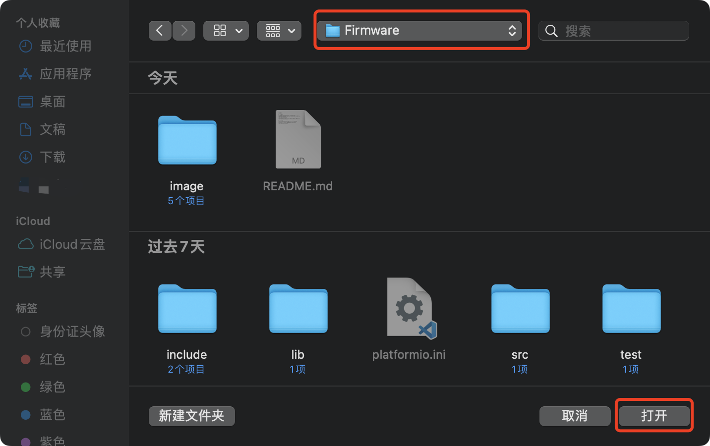

# 板卡固件烧录

---
**注意：当前固件仅编译完成，尚未完善，如果没有软件开发能力，暂时请勿烧录！！！！！！**

---

## 一、环境配置
1. 下载并安装[VSCode](https://code.visualstudio.com)；
2. 打开VSCode，进入插件市场，搜索Chinese，安装简体中文插件，之后重启VSCode；

  
    
    

<!-- 
 -->
3. 重启后进入插件市场，搜索platformio，选择第一个结果安装，之后重启VSCode；

  
    

## 二、导入工程
1. 进入VSCode后打开platformio，等待platformio core初始化完成；

  
    

2. 点击**Pick a folder**，选择当前仓库的**Firmware**目录；

  
    
    

3. 等待工程初始化完成（第一次初始化会比较慢）。

## 三、固件下载
1. 使用USB线连接板卡和电脑；
2. 点击下方Upload按钮，等待固件烧录完成后即可。

  
    

